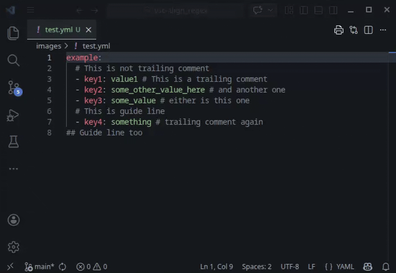

# Align Regex

This extension is originally based on [vscode-align-by-regex](https://github.com/janjoerke/vscode-align-by-regex)

This extension aligns multiple lines of text by regular expressions. It can align anything, e.g., trailing comments, key-value pairs, or any text patterns defined by regular expressions.

## Features

- Align multiple lines of text by regular expressions.
- Store regular expressions as templates for repeated use.
- Run alignment from the editor context menu.
- Support aligning multiple line selections and cursors simultaneously.

## Extension Settings

* `align.regex.templates`: Templates for regular expressions used for alignment. The default built-in templates are:
```json
{
    "align.regex.templates": {
        "Trailing comments #": "(?<=\\S.*)\\s+#",
        "Trailing comments //": "(?<=\\S.*)\\s+//",
        "abc": "=|,|:"
    }
}
```

## Usage
- Select multiple lines or multiple cursors
- Right-click on the editor, and choose `Align Regex`
- Select templates or input Regular Expression.




## Release Notes

### 1.0.2
- Revise the default regular expression templates.

### 1.0.1
- Change icon

### 1.0.0
- Support aligning multiple selections and cursors simultaneously.
- Run alignment from the editor context menu.
