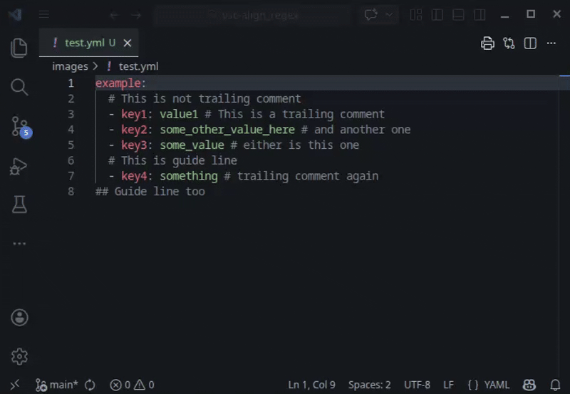

# Align Regex

This extension is originally based on [vscode-align-by-regex](https://github.com/janjoerke/vscode-align-by-regex)

It allows you to align multiple lines of text using regular expressions. You can easily align trailing comments, key-value pairs, or any custom text pattern you define.

## Features
- Regex-Based Alignment: Align multiple lines of text simultaneously using powerful regular expressions.
- Versatile Formatting: Effortlessly handle trailing comments, assignment operators, key-value pairs, and complex code structures.
- Fully Customizable: Define and save custom regex patterns as reusable templates to match your expectation.
- Seamless Editor Integration: Run alignment commands instantly from the editor's context menu.
- Multi-Cursor Support: Align multiple independent line selections and cursors at the same time.

## Extension Settings

* `align.regex.templates`: Templates for regular expressions used for alignment. The default built-in templates are:
```json
{
    "align.regex.templates": {
        "Multiple signs": "=|,|:",
        "Trailing comments #": "(?<=\\S.*)\\s+#",
        "Trailing comments //": "(?<=\\S.*)\\s+//",
        "Trailing comments %": "(?<=\\S.*)\\s+%",
    }
}
```

## Usage
- Select multiple lines or multiple cursors
- Right-click on the editor, and choose `Align Regex`
- Select templates or input Regular Expression.


